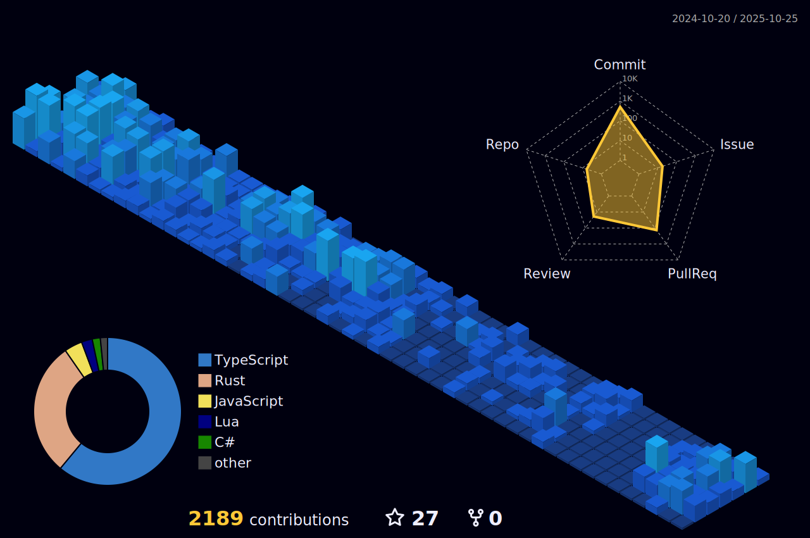

<h1 align="center">Welcome to my Profile 👋</h1>

<h1 align="center" style="margin-top: 24px"">Ludovic Debever - Fullstack Developer</h1>

<h3 align="center"> Favorite Languages </h3>

  
  

<h3 align="center"> Favorite Frameworks </h3>

  
  
  
  
  

<h3 align="center"> Frameworks </h3>

  
  
  
  
  
  
  
  
  

<h3 align="center"> Databases </h3>

  
  

<h3 align="center"> Tools </h3>

  
  

<h3 align="left"> Links </h3>

<h3 align="left"> Stats & Repos </h3>

